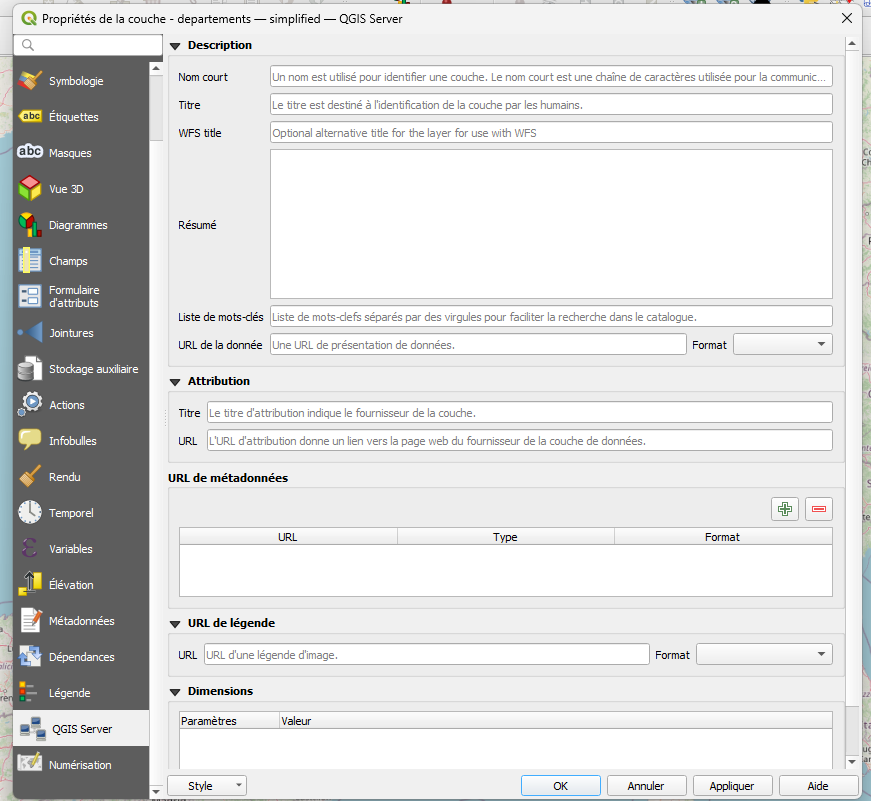
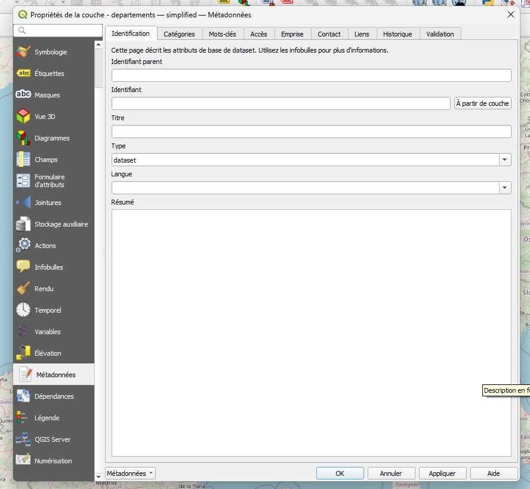

# Métadonnée 

https://just-sudo-it.be/tree-afficher-larborescence-des-fichiers-et-dossiers/


Tree : Afficher l’arborescence des fichiers et dossiers 

installer tree
```bash
sudo apt install tree
```
voir ton arborescence 
```bash
tree 
```
Enregistrer dans un fichier 
```bash
tree >> tree.md
```

-> [document exemple](tree.md)


https://github.com/cnigfr/metadonnee/tree/main/MappingINSPIRE-DCAT

QGIS : métadonnées 






lien carte : 
https://solagro.org/nos-domaines-d-intervention/agroecologie/carte-pesticides-adonis


https://github.com/pi-geosolutions/

